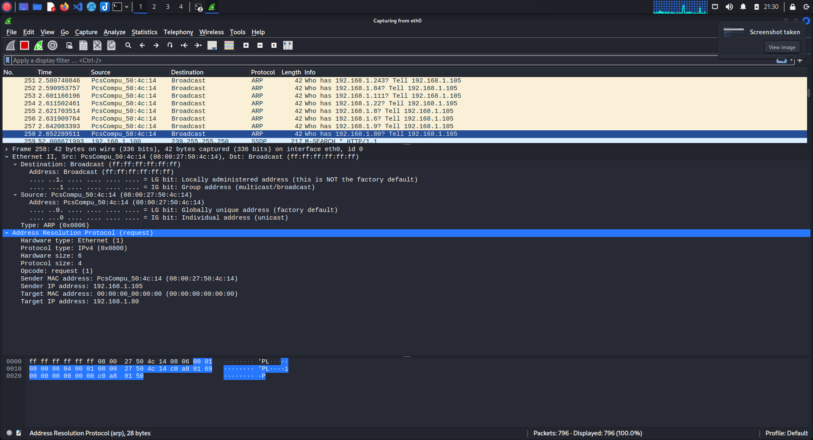
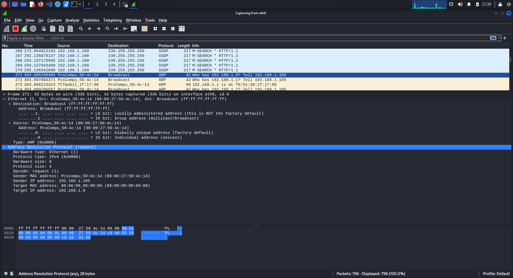

To try to answer why sometimes ARP scans of `arp-scan` doesn't match `ettercap`   I'm gonna `wireshark`  

`sudo arp-scan -I eth0 192.168.1.0/24`  
`wireshark` analysis:  
broadcast of ARP requests (`Ethernet frame` destination (target MAC address) - `ff:ff:ff:ff:ff:ff`) for every listed IP  

`sudo ettercap -G`    
Hosts - `scan for hosts` -> Hosts - `host list`  
`wireshark` analysis:  
broadcast of ARP requests  

#### Scans are looking almost exactly the same :/  