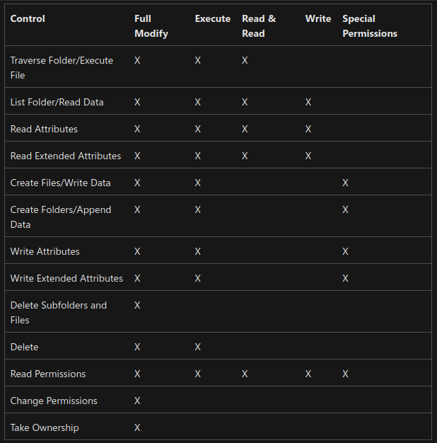
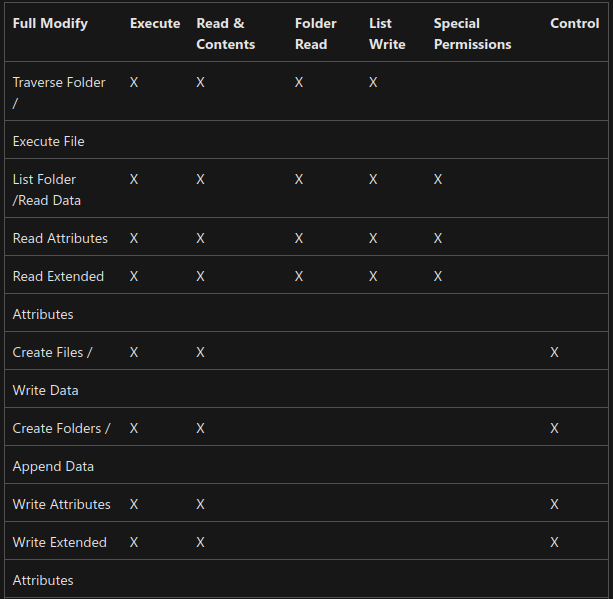
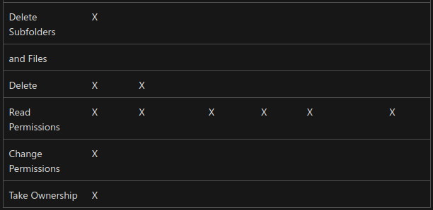

#### Permissions:
##### basic permissions
groups of `special permissions`

- `read` - viewing and listing of files and subfolders / viewing or accessing of the file's contents (**only permission needed to run scripts**)
- `write` - adding of files and subfolders / writing to a file
- `read & execute` - viewing and listing of files and subfolders as well as executing of files; inherited by files and folders / viewing and accessing of the file's contents as well as executing of the file
- `list folder contents` - viewing and listing of files and subfolders as well as executing of files; inherited by folders only (if you want to enable viewing but not necessairly executing of whats inside) / no meaning for files
- `modify` - reading and writing of files and subfolders; allows deletion of the folder / reading and writing of the file; allows deletion of the file
    (**if a user has full control over a folder, the user can delete files in the folder regardless of the permission on the files**)
- `full control` - reading, writing, changing, and deleting of files and subfolders / reading, writing, changing and deleting of the file
  
Actions that users can perform are based on the **sum of all the permissions assigned** to the user and to all the groups the user is a member of

##### special permissions
for `files`

for `folders`

When you set permissions for parent folders, **you can force all files and subfolders within the folder to inherit the permissions**.
You do this by selecting `Reset Permissions On All Child Objects` and `Enable Propagation Of Inheritable Permissions`