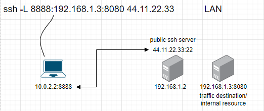
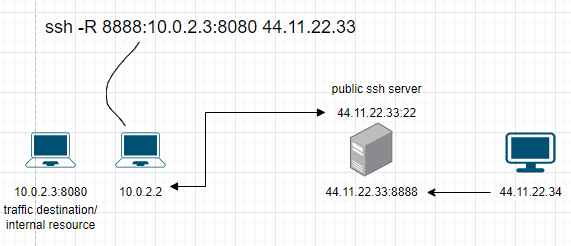

suite of utilities
i.a.
`openssh-client`, `ssh`, `scp`, `sftp` - client side
`openssh-server`, `sshd`,  `sftp-server` - server side
`ssh-add`, `ssh-agent`, `ssh-keysign`, `ssh-keygen`, `ssh-keyscan`, `ssh-copy-id` - key management

Authentication may be i.a. `host-based`, `password` or *`public key`*

#### server
`systemctl service sshd` to check if service is running (you might need to install `openssh-server`)

in `etc/ssh/` there should be automatically created i.a. `keys` for the server and `sshd_config`
in `/etc/ssh/sshd_config`: 
- change port
- PermitRootLogin no - after creating non-root user on server
- PasswordAuthentication no - after checking if keys are working
- MaxAuthTries 3
- HostbasedAuthentication no
- X11Forwarding no
remember to **uncomment** and chanage to **no**. If someone somehow switch my ssh default settings, commented per-user config won't overwrite malicious config.

For remote tunnels:
- AllowAgentForwarding yes
- AllowTcpForwarding yes
- GatewayPorts yes
`sudo systemctl restart sshd` - to reload config

#### keys management
`ssh-keygen -t ed25519 -C "Keys to MyServer"` - be careful to NOT overwrite existing keys!
`-t` type (`ed25519` is shorter and more secure than `rsa`)
`-C` comment. By default `username@hostname`
```
Generating public/private rsa key pair.
Enter file in which to save the key (/home/kali/.ssh/id_ed25519): 
Created directory '/home/kali/.ssh'.
Enter passphrase (empty for no passphrase): 
Enter same passphrase again: 
Your identification has been saved in /home/kali/.ssh/id_ed25519
Your public key has been saved in /home/kali/.ssh/id_ed25519.pub
```
passphrase is used to secure key on client side (if someone stole it, she still need passphrase)

paste `public key` into `~/.ssh/authorised_keys` on the server
you can use `ssh-copy-id -i ~/.ssh/id_ed25519.pub kali@192.168.1.109`
`-i` input file

`ssh -i ~/.ssh/id_ed25519 kali@192.168.1.109`
`-i` input file (with which `PRIVATE key` I want to log in)

to cache unlocked (without the need for passphrase) `private key` with `ssh-agent`:
`ssh-add ~/.ssh/id_ed25519`
You don't have to use passphrase unless you close the terminal

#### pro tips
user-specific config:
- `~/.ssh/config`
```
Host MyServer
	Hostname 192.168.1.109
	Port 2222
	User kali
```
That way I can ssh usint `ssh MyServer` instead `ssh -p 2222 kali@192.168.1.109`

#### tunneling
`ssh -L 127.0.0.1:8888:192.168.1.3:8080 kali@44.11.22.33`
`-L` local forward
`127.0.0.1:8080` local machine IP and port (if no IP - localhost assumed)
`192.168.1.3:8080` target to send data to
`kali@44.11.22.33` username and IP of ssh server
a.k.a
`ssh -L 8888:192.168.1.3:8080 kali@44.11.22.33`
forward from localhost:8888 (because there is nothing before 8888 - localhost assumed) (client) -> 44.11.22.33 (server) -de-encapsulation-> forward -> 192.168.1.3:8080

ISP sees `ssh` traffic, just as 44.11.22.33. After de-encapsulation at 44.11.22.33 she'll see packets for 192.168.1.3:8080 and forward them there. 192.168.1.3 might respond, and response will be send back via `ssh`

`ssh -L 8080:localhost:80 kali@192.168.1.109`
forward from localhost:8080 (cilent) -> kali@192.168.1.109:80 (localhost:80) (server) 
e.g.
- access remote resources out of reach of client (but not out of reach for server)
- RDP job (client) -> home (server)


`ssh -R 8888:10.0.2.3:8080 kali@44.11.22.33`
`-R` remote forward
forward from 44.11.22.33:8888 (server) -> 10.0.2.2 (client) -de-encapsulation-> forward -> 10.0.2.3:8080 

10.0.2.3 might respond back

`ssh -R 31337:localhost:22 kali@192.168.1.109`
`-R` remote forward
forward from kali@192.168.1.109:31337 (localhost:31337) (server) -> localhost:22 (client)
e.g.
- give access to local resources (via client) to the server
- RDP home (server) -> job (client)


`ssh -D 9999 kali@192.168.1.109`
`-D` dynamic forward (creates SOCKS proxy server) - proxy server's programs require configuration  
listen on 9999 (client). When connection to this port -forward-> application protocol determine which port to connect (server)
e.g.
set up localhost:9999 SOCKS proxy on firefox (client) -> web requests are forwarded to server, answers are sent back to via ssh tunnel (to 9999)


`ssh -J 192.168.1.101,192.168.1.102,192.168.1.103 192.168.1.109`
`-J` jump, a chain of connections.


#### "pushing" (sending to)
`scp *.html xubuntu@192.168.1.109:directory`
copy files to a directory inside default directory we log into

`scp -r directory-with-sth xubuntu@192.168.1.109:`
`-r` recursively send whole directory


#### "pulling" (copying from)
`scp xubuntu@192.168.1.109:webpage-ssh/index.html .`

`scp -r xubuntu@192.168.1.109:webpage-ssh/ .`
`-r` recursively copy whole directory

#### hardening
- port knocking
- fail2ban (after few unsuccessfull login tries -> send rule to fw to ban IP for some time)
- CIS Benchmarks - benchmark for auditors to check if config is right. e.g. [here](https://github.com/WoTTsecurity/agent/issues/277)