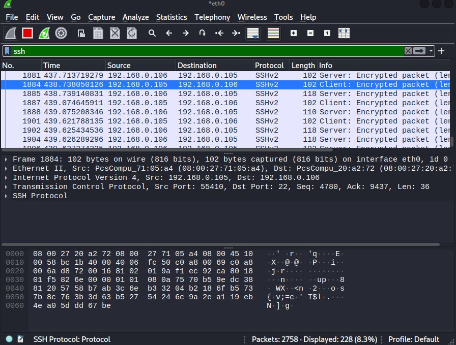

Sniff `eth0` interface on kali VM with `wireshark`-> open `ssh` connection with other VM -> send passwords in plain text file using `scp` -> try to find passwords in `wireshark` logs  

`ssh root@192.168.1.106`   
`scp plik.txt root@192.168.1.106:/home/root`  

