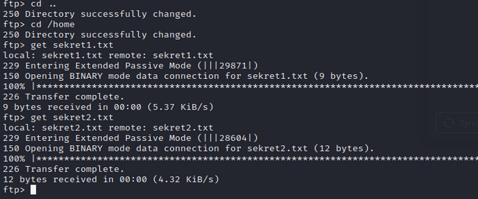
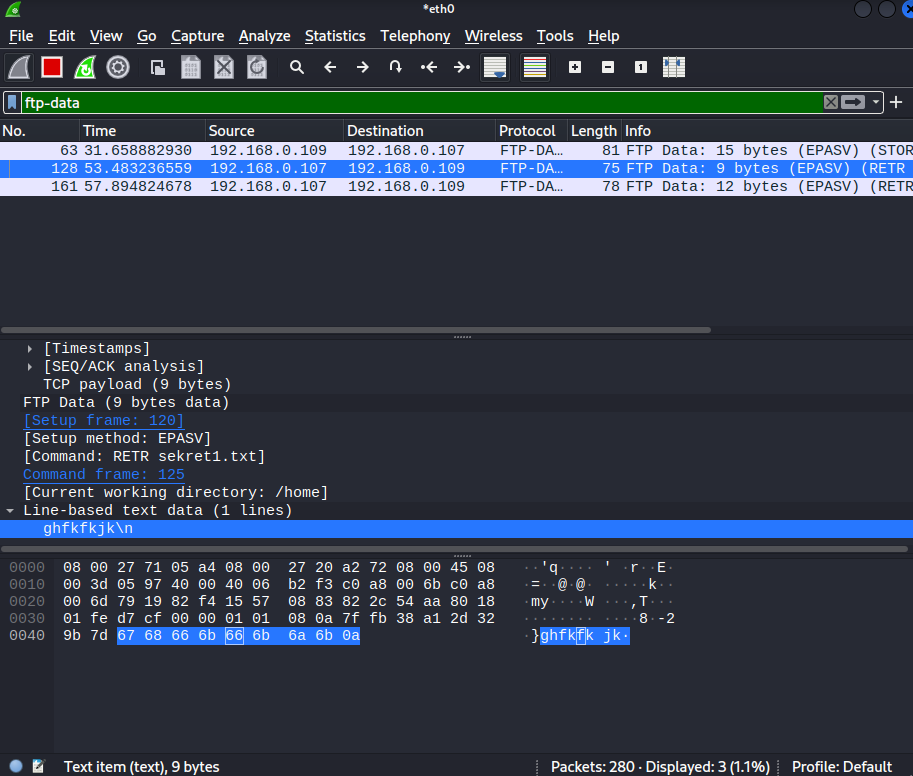

Configuration of `/etc/vsftp.conf` on server side  

Sniff `eth0` interface on Kali VM with `wireshark`-> open `ftp` connection with other VM -> send passwords in plain text file using `ftp` -> try to find passwords in `wireshark` logs  (filtr `ftp-data`)  

Sending from Kali (`put`):

Downloading (`get`):

`wireshark`

